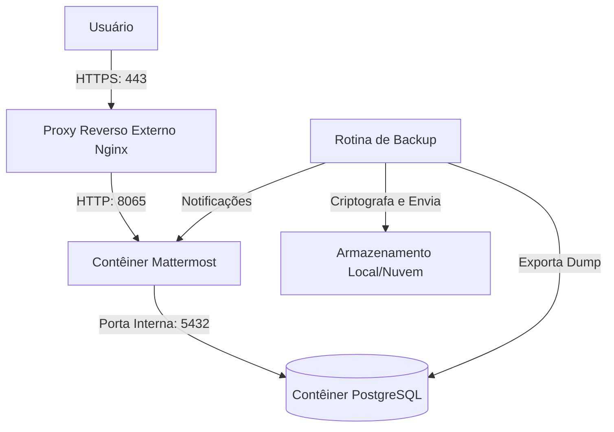

# CDC Chat (Mattermost Infrastructure)

Este repositório armazena a infraestrutura conteinerizada e as diretrizes de implantação do canal corporativo de comunicação da CDC, baseado no Mattermost Team Edition.

[](https://mattermost.com/)
[](https://www.postgresql.org/)
[](LICENSE)
[](#)

---

## Arquitetura

O sistema opera com o Mattermost Team Edition como frontend de colaboração e chat em tempo real, e o PostgreSQL como banco de dados relacional. Toda a infraestrutura é orquestrada via Docker Compose.



---

## Estrutura de Diretórios

```text
/
├── docs/                      # Documentação técnica padronizada
│   ├── diretrizes_documentacao.md
│   ├── estrategia_execucao.md
│   ├── migration_guide.md
│   ├── ajuda_infra.md
│   ├── postmortem.md
│   ├── troubleshooting.md
│   ├── politica_backup.md
│   └── prompt_ia.md
├── docker-compose.yml         # Orquestrador de serviços e redes
├── .env.example               # Modelo das variáveis de ambiente públicas
└── .gitignore                 # Arquivos ignorados pelo Git (dados, .env)
```

---

## Requisitos Mínimos

| Componente | Versão Mínima | Finalidade |
| :--- | :---: | :--- |
| Docker | 20.10+ | Runtime de execução de contêineres. |
| Docker Compose | 2.0+ | Orquestração simplificada dos serviços. |
| PostgreSQL | 16.4 | Motor de banco de dados para armazenamento persistente. |

---

## Configuração do Ambiente

1. Copie o arquivo de exemplo para criar a sua configuração local:
   ```bash
   cp .env.example .env
   ```
2. Abra o arquivo `.env` gerado e configure suas credenciais de banco e do Mattermost:
   - A senha do banco de dados (`DB_PASS`) deve ser forte e única.
   - O endereço de webhook do Mattermost (`MATTERMOST_WEBHOOK_URL`) deve ser tratado como segredo absoluto. Nunca envie este arquivo `.env` para o Git.

---

## Inicialização Rápida

1. **Subir os serviços em segundo plano:**
   ```bash
   docker compose up -d
   ```
2. **Verificar o status dos contêineres e healthcheck:**
   ```bash
   docker compose ps
   ```
3. **Validar acesso HTTP local:**
   ```bash
   curl -I http://localhost:8065
   ```
4. **Verificar os logs de inicialização do sistema:**
   ```bash
   docker compose logs -f mattermost
   ```
5. **Realizar o setup primário:**
   Acesse no navegador `http://localhost:8065` (ou o domínio mapeado da VPS) e siga o assistente de instalação do Mattermost para cadastrar a conta de administrador primária.

---

## Cheat Sheet (Comandos Rápidos)

- **Subir contêineres em segundo plano:** `docker compose up -d`
- **Derrubar e parar os serviços:** `docker compose down`
- **Visualizar logs em tempo real:** `docker compose logs -f`
- **Acessar o terminal interativo do Mattermost:** `docker compose exec mattermost sh`
- **Acessar o terminal do banco de dados:** `docker compose exec db psql -U mmuser -d mattermost`

---

## Documentação Complementar

Abaixo estão os links para as guias detalhadas do projeto:
- [Diretrizes de documentação](docs/diretrizes_documentacao.md) — Regras de criação, manutenção, revisão e evolução da documentação.
- [Estratégia de execução](docs/estrategia_execucao.md) — Desenvolvimento, branches, ambientes, releases e implantação.
- [Guia de migração](docs/migration_guide.md) — Acesso seguro, diagnóstico, exportação e migração de ambientes.
- [Ajuda de infraestrutura](docs/ajuda_infra.md) — Containers, redes, portas, DNS, variáveis e Mattermost.
- [Post-mortem](docs/postmortem.md) — Modelo sem culpabilização para análise de incidentes.
- [Troubleshooting](docs/troubleshooting.md) — Diagnóstico e solução de problemas recorrentes.
- [Política de backup](docs/politica_backup.md) — Backup, criptografia, retenção, restauração e alertas no Mattermost.
- [Contexto para IA](docs/prompt_ia.md) — Contexto arquitetural e prompts operacionais para assistentes de IA.
- [Guia de plugins](docs/guia_plugins.md) — Guia de plugins instalados e recomendados para a organização.
- [Plugin de Calendário CDC](docs/desenvolvimento_plugin_calendario.md) — Especificação técnica para desenvolvimento do plugin customizado de calendário.
- [Planejamento de Issues](docs/issues_planejamento.md) — Inventário de GitHub Issues estruturadas para acompanhamento das tarefas do repositório.
- [Automação de GitHub Issues](docs/guia_automacao_github.md) — Guia de automação de Issues com GitHub Actions e Prompt Universal.

---

## Importância da Documentação

A documentação técnica é parte viva do ecossistema do CDC Chat. Ela deve evoluir continuamente junto com o código, regras de infraestrutura, políticas de segurança, estratégias de backup e integrações. Manter os documentos atualizados em cada ciclo de alteração garante a resiliência operacional e preserva a governança sobre os nossos serviços.
