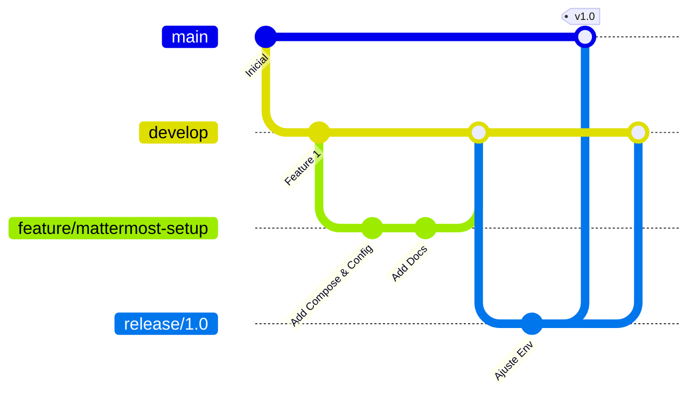

# Estratégia de Execução (CDC Chat)

Este documento detalha o fluxo de desenvolvimento, gerenciamento de branches, ciclos de deploy, comunicação e rollback para o projeto CDC Chat (Mattermost).

---

## Visão geral

- **Nome do Projeto:** CDC Chat
- **Objetivo Principal:** Disponibilizar uma plataforma corporativa e segura de comunicação interna para a equipe e voluntários da ONG, baseada no Mattermost Team Edition.
- **Componentes Principais:**
  - Aplicação Mattermost Team Edition (Go/React) rodando em contêiner Docker.
  - Banco de Dados PostgreSQL (16.4-alpine) para armazenamento persistente das mensagens, usuários, canais e metadados.
- **Tecnologias Utilizadas:** Go, React, PostgreSQL, Docker, Docker Compose, Nginx (Proxy Reverso externo), Mattermost (Notificações locais/externas).
- **Integração com Mattermost:** Alertas automáticos de status de backups e janelas de deploy enviadas ao canal `#alertas-infra` do próprio Mattermost ou de um servidor de monitoramento.

---

## Organização dos repositórios

O projeto CDC Chat é mantido em um único repositório estruturado da seguinte forma:
- `/` (Raiz): Arquivos de orquestração Docker (`docker-compose.yml`, `Dockerfile`), variáveis públicas (`.env.example`), arquivos de exclusão (`.gitignore`) e guias operacionais.
- `/docs/`: Documentação técnica padronizada do projeto.
- `/data/`: Diretório local do host reservado para persistência de dados (ignorado pelo Git).
  - `/data/db/`: Arquivos físicos do banco PostgreSQL.
  - `/data/config/`: Configurações lógicas do servidor Mattermost.
  - `/data/data/`: Arquivos enviados por usuários (imagens, documentos).
  - `/data/plugins/`: Plugins instalados na ferramenta.
  - `/data/logs/`: Logs de auditoria e depuração da ferramenta.

---

## Estratégia de branches

Adotamos o fluxo simplificado do Gitflow para gerenciar o ciclo de vida do código de infraestrutura:



### Branches e Finalidades:
- **`main`:** Contém o código estável e homologado de produção da infraestrutura.
- **`develop`:** Branch de integração contínua. Recebe merges de features testadas.
- **`feature/*`:** Criadas a partir de `develop` para desenvolver melhorias, novos contêineres ou scripts de apoio.
- **`release/*`:** Criadas para a validação final e ajustes de homologação antes de promover para a main.
- **`hotfix/*`:** Criadas a partir da `main` para sanar problemas operacionais urgentes de produção.

---

## Ambientes

Trabalhamos com os seguintes ambientes lógicos:

### 1. Desenvolvimento (Ambiente Local)
- **Objetivo:** Testar scripts de backup, novas variáveis de configuração ou customizações locais.
- **URL/Acesso:** `http://localhost:8065`
- **Banco de Dados:** PostgreSQL com dados simulados locais.
- **Segurança:** Não utilizar dumps de produção sem prévia anonimização de dados pessoais das conversas.

### 2. Homologação / Staging
- **Objetivo:** Validar atualizações do motor do Mattermost e migrações de dados de banco.
- **URL/Acesso:** `http://<HOMOL_SERVER_IP>:8065` (ou subdomínio privado).
- **Banco de Dados:** Instância PostgreSQL isolada contendo dados higienizados para validação.
- **Notificações:** Direcionadas para canal de monitoramento sandbox.

### 3. Produção
- **Objetivo:** Ambiente de comunicação real dos colaboradores e voluntários.
- **URL/Acesso:** `https://chat.<DOMINIO_DO_PROJETO>`
- **Banco de Dados:** Instância PostgreSQL dedicada com armazenamento local seguro em `./data/db`.
- **Notificações:** Alertas críticos no canal `#alertas-infra`.

---

## Fluxos funcionais importantes

O ecossistema do Mattermost baseia-se em três fluxos críticos:

### 1. Fluxo de Instalação e Inicialização Primária
1. O Docker Compose sobe o banco de dados `db`.
2. O contêiner `mattermost` aguarda que o banco responda (healthcheck).
3. Na primeira execução, o Mattermost detecta que o banco está vazio e cria mais de 100 tabelas SQL padrão de mensageria.
4. O primeiro usuário que se conecta via web ao endereço `https://chat.<DOMINIO_DO_PROJETO>` é designado como Administrador de Sistema (System Admin).

### 2. Fluxo de Envio e Armazenamento de Mídia
1. O usuário digita uma mensagem e anexa uma imagem.
2. O texto e os metadados da mensagem são persistidos na tabela `posts` do PostgreSQL.
3. O arquivo físico do anexo é gravado localmente no contêiner em `/mattermost/data` (mapeado para `./data/data` no host).

### 3. Fluxo de Autenticação e Sessão
1. O usuário insere credenciais na tela de login.
2. A aplicação valida o hash da senha contra o registro no PostgreSQL.
3. É gerada uma sessão registrada no banco de dados e gravado um token de sessão (`MMAUTHTOKEN`) no cabeçalho/cookie do navegador do usuário.

---

## Critérios de promoção

Para promover código ou imagens de Homologação para Produção, deve-se cumprir:
- [ ] O build de imagens locais passou sem erros.
- [ ] O banco de dados PostgreSQL foi testado sob a nova versão de imagem e migrou com sucesso.
- [ ] Backup completo (banco e anexo de dados) de produção foi gerado e validado.
- [ ] O plano de rollback foi planejado e revisado.
- [ ] O arquivo `.env.example` e a documentação técnica estão alinhados com o novo código.
- [ ] A janela de manutenção foi anunciada aos usuários com antecedência no Mattermost.

---

## Comunicação pelo Mattermost

As notificações de deploy devem seguir o padrão estruturado abaixo:

### Início de Janela de Deploy
```text
[DEPLOY INICIADO] - CDC Chat (Mattermost)
Ambiente: Produção
Versão: v1.0
Responsável: <SSH_USER>
Status: Parando contêineres antigos e executando migração de banco de dados.
```

### Finalização de Janela de Deploy (Sucesso)
```text
[DEPLOY CONCLUÍDO] - CDC Chat (Mattermost)
Ambiente: Produção
Versão: v1.0
Status: Serviço online em https://chat.<DOMINIO_DO_PROJETO>. Testes de conectividade concluídos com sucesso.
```

### Falha de Deploy / Rollback Ativado
```text
[DEPLOY FALHOU - ROLLBACK] - CDC Chat (Mattermost)
Ambiente: Produção
Erro: Falha de conexão ou corrupção de tabelas na inicialização do contêiner Mattermost.
Status: Executando rollback imediato para a versão anterior v0.9.
```

---

## Rollback

Se ocorrer um erro grave no deploy, siga as ações de reversão a seguir:

### Passo 1: Rollback de Imagem e Código
1. Reverta as alterações locais no Git para a tag estável anterior (ex: `v0.9`).
2. Recrie e reinicie os contêineres:
   ```bash
   docker compose down
   docker compose up -d --build
   ```

### Passo 2: Rollback do Banco de Dados e Arquivos
Se a inicialização falhar devido a alterações de banco incompatíveis com a versão anterior:
1. Pare os contêineres:
   ```bash
   docker compose down
   ```
2. Restaure o dump do PostgreSQL e a pasta de dados do Mattermost (`./data/data`) a partir do backup físico de pré-deploy (conforme procedimento de restauração em `docs/politica_backup.md`).
3. Inicie os contêineres com a versão anterior estável.

### Passo 3: Comunicação
1. Informe a equipe técnica e os usuários no canal alternativo de suporte/infraestrutura sobre a ativação do rollback e a previsão de normalização do sistema.

---

Última revisão: 2026-07-13  
Responsável pela revisão: Antigravity  
Motivo da revisão: Inicialização da estratégia de execução e deploys do Mattermost  
